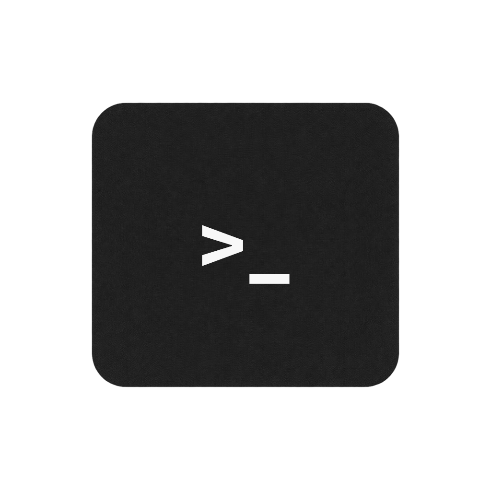

<p align="center">
  
</p>

# Liquid Glass Terminal

A local-first Electron terminal with a neutral frosted-glass interface. It uses a customized Windows App SDK Desktop Acrylic controller on supported Windows 11 systems, Vibrancy on macOS, and a stable opaque treatment on Linux and older Windows versions.

> **Preview:** v0.1.0 is an unsigned, unnotarized preview. Review the source and release checksums before running packaged artifacts.

[日本語](README.ja.md) · [Architecture](docs/architecture.md) · [Native QA](docs/native-qa.md) · [Security](SECURITY.md)

## Highlights

- Real local shells through `node-pty`, rendered by xterm.js with WebGL and DOM fallback.
- A single window with draggable tabs, shell profile discovery, search, and restartable exited sessions.
- Windows PowerShell 7/Windows PowerShell/cmd/Git Bash/WSL discovery; `$SHELL`, zsh, and bash discovery on macOS/Linux.
- Multiline paste confirmation, mandatory confirmation above 1 MiB, safe external links, and insert-only file/folder drop.
- English and Japanese UI, system/light/dark themes, live 35–85% glass opacity, and persisted settings/window geometry.
- Reduced-transparency, high-contrast, reduced-motion, and opt-in screen-reader adaptations.
- No telemetry, remote content, update checks, crash uploads, or shell-profile injection.

## Platform behavior

| Platform | Minimum                     | Visual material                                          | Architectures                  |
| -------- | --------------------------- | -------------------------------------------------------- | ------------------------------ |
| Windows  | Windows 10 x64              | Adjustable Acrylic on Windows 11 22H2+; opaque otherwise | x64                            |
| macOS    | macOS 12                    | Adjustable native Vibrancy                               | Intel x64, Apple Silicon arm64 |
| Linux    | Ubuntu 22.04+/Fedora family | Stable opaque neutral surface                            | x64                            |

Linux and Windows 10 intentionally do not promise visibility of applications behind the terminal. The native implementations use compositor backdrops rather than desktop capture, so the app does not request screen-recording permission or retain pixels from other windows. A normal resizable window is preserved on every platform.

Glass opacity defaults to 60% and changes live in 1% steps. High contrast, reduced transparency, screen-reader mode, an unsupported platform, or a Windows compositor fallback switches to a safe opaque surface, disables the slider with an explanation, and preserves the saved value for later restoration.

## Develop locally

Requirements:

- Node.js **24.19.0** with npm **11.17.0**.
- Windows native builds: Visual Studio 2022 Build Tools with Desktop development with C++. `bootstrap:native` restores the pinned Windows App SDK, builds the x64 Node-API addon, and stages its self-contained runtime beside Electron.
- macOS native builds: current Xcode Command Line Tools.
- Linux native builds: Python, `make`, a C++ compiler, and the normal Electron runtime libraries.

```powershell
npm install
npm run audit:install-scripts
npm run bootstrap:native
npm start
```

Dependency lifecycle scripts are disabled by `.npmrc`. `audit:install-scripts` verifies the reviewed, version-pinned allowlist, while `bootstrap:native` explicitly obtains Electron and rebuilds the PTY module for the active Electron ABI.

Before a release, `npm audit --omit=dev` must be clean. See the [security policy](SECURITY.md#dependency-audit-scope) for how packaging-only development advisories are handled.

Quality gates:

```powershell
npm run check
npm run package
npm run test:e2e
```

Set `LGT_NATIVE_TESTS=1` when the native PTY has been prepared to include the real-shell integration test.

## Usage

Packaged applications accept one public argument:

```text
liquid-glass-terminal --cwd <directory>
```

Relative paths resolve from the caller's working directory. An invalid path opens the home directory and shows a notification. Starting a second instance focuses the existing window and opens a new tab at the requested directory.

### Keyboard

| Action              | Windows/Linux              | macOS                     |
| ------------------- | -------------------------- | ------------------------- |
| New / close tab     | Ctrl+T / Ctrl+W            | Cmd+T / Cmd+W             |
| Find                | Ctrl+F                     | Cmd+F                     |
| Paste               | Ctrl+Shift+V               | Cmd+V                     |
| Copy                | Ctrl+C with a selection    | Cmd+C                     |
| Send interrupt      | Ctrl+C without a selection | Ctrl+C                    |
| Next / previous tab | Ctrl+Tab / Ctrl+Shift+Tab  | Ctrl+Tab / Ctrl+Shift+Tab |
| Reorder active tab  | Alt+Shift+Left/Right       | Alt+Shift+Left/Right      |
| Settings            | Ctrl+,                     | Cmd+,                     |

Links open only with Ctrl/Cmd+click and only for `http:` or `https:` URLs. Dropped paths are quoted for the selected shell and inserted without pressing Enter.

## Build and release

Electron Forge produces a Windows Setup EXE, macOS DMG/ZIP, and Linux DEB/RPM. A `v*` tag runs the full matrix and creates a draft GitHub Release with SHA-256 checksums. Signing, notarization, auto-update, session restoration, SSH management, split panes, arbitrary custom profiles, plugins, and inline images are not part of v0.1.0.

See [CONTRIBUTING.md](CONTRIBUTING.md) before changing dependencies or native code. Liquid Glass Terminal is independent software and is not affiliated with Apple or Microsoft.

## License

Application code is available under the [MIT License](LICENSE). Cascadia Mono PL is bundled under the SIL Open Font License; see [third-party notices](THIRD_PARTY_NOTICES.md).
